# Lecture 1: 机器学习的目标和灵感 | Goals and Inspirations of ML

## 拉普拉斯决定论 | Démon de Laplace

我堂妹在科大上大一，我帮她辅导力学时候看到郑永令《力学》2.8节里的一段话，大意是

> [拉普拉斯在他的《概率论》中写](https://zh.wikipedia.org/wiki/%E6%8B%89%E6%99%AE%E6%8B%89%E6%96%AF%E5%A6%96)：知道了初始条件和所受的力，可以预测未来的一切。
>
> 然而，后来大家发现，有三种现象很难预测：第一种来自于量子力学（海森堡不确定性原理），第二种来自于复杂系统（[More Is Different](https://mp.weixin.qq.com/s/NQR3T5MNxU_a07XqshCN0w)），第三种来自于混沌（微分方程的不稳定性、三体、蝴蝶效应）。

说得很对。这三种不可预测性中：

1. 第三种最好解决，每隔一段时间测一下就行了。天气预报就是这么做的。
2. 第一种，量子力学的几种诠释（[哥本哈根](https://zh.wikipedia.org/wiki/%E5%93%A5%E6%9C%AC%E5%93%88%E6%A0%B9%E8%A9%AE%E9%87%8B)、[德布罗意-波姆](https://zh.wikipedia.org/wiki/%E5%BE%B7%E5%B8%83%E7%BD%97%E6%84%8F-%E7%8E%BB%E5%A7%86%E7%90%86%E8%AE%BA)、[多世界](https://zh.wikipedia.org/wiki/%E5%A4%9A%E4%B8%96%E7%95%8C%E8%AF%A0%E9%87%8A)）还没分出胜负，Einstein和Bohr关于上帝扔不扔骰子的辩论还在继续（德布罗意-波姆属于隐变量理论，相信量子现象是由隐变量决定的，因此并非随机；大家可以思考一下此事和教材上所谓的“真随机数和伪随机数”的关系；“隐变量”这词后来被引进了统计、机器学习、神经科学，指那些无法直接观测到的变量）。但还不紧急，因为这几种诠释都承认薛定谔方程，只不过它们对于薛定谔方程的诠释不同。所以:"*Shut Up and Calculate.*"。
3. 第二种最紧急。统计物理、生物神经网络、深度学习、遗传学、气候、经济、蛋白质结构、意识都属于它。第一，ChatGPT已经让部分人（包括Bengio和Hinton）感到恐惧，人类第一次造出了一个自己无法理解的并且才华横溢的机器；第二，自动驾驶正逐渐走进生活，但很多人不信任一个黑盒子来开车；最后，经济危机是人类社会的最大也是最紧急难题之一，我猜每个想让自己和家人过上更好生活的人都会渴望预测并阻止它。


## 复杂系统 | More Is Different

包括狄拉克和费曼在内的众多物理学家都相信——万物的规律可以化简为基本单元的规律。这种思想被称之为还原论，或者叫bottom-up。凝聚态和化学只是量子力学的小小应用，生物学是化学的应用，社会科学则是生物学的应用。还原论的思想深入每个物理学生的脑海：力学和电磁学中的微元，光学中的独立传播和叠加，电动力学里计算场的能量密度，量子力学中尝试构建势能，统计物理中建立宏观量和微观量之间的联系。

1972年，Philip Anderson写了一篇短文——More Is Different，提出了构建论。此文可以用一句话总结：

> The ability to reduce everything to simple fundamental laws does not imply the ability to start from those laws and reconstruct the universe.

所以凝聚态化学不是应用量子力学，生物学不是应用化学，社会科学不是应用生物学。所以只要基本单元的数量足够多，就可以“涌现”出一些不一样的性质。（这就是More Is Different）

还原论和构建论是哲学上的倾向。每个人都有自己的倾向，我还是偏向还原论。

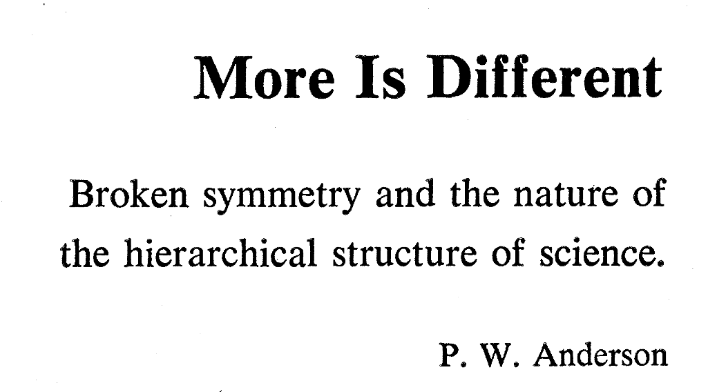


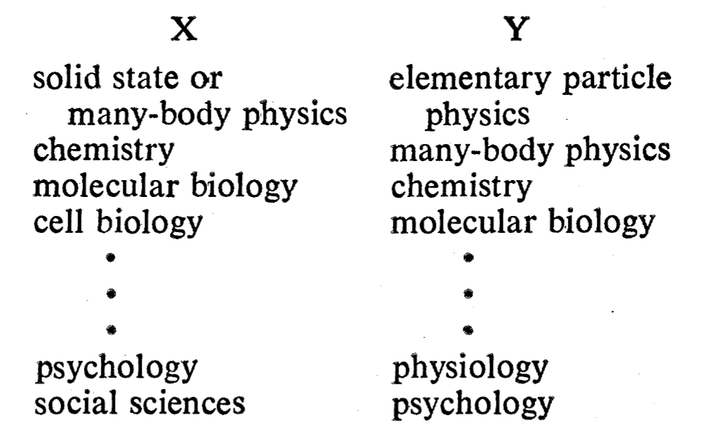

<center><a href="https://www.science.org/doi/10.1126/science.177.4047.393">Anderson, 1972</a></center>

PS: 

我希望大家能尊重其他的学科。

就我个人感受而言，和数学、物理学一样，生物学、经济学同样需要高度的直觉与洞察。

物理学家喜欢把一切都简化成数学公式（特别是微分方程），**但是自然界的一切规律都可以用数学公式描述吗？我认为未必——有的可能只能用自然语言表述，有的可能是自然语言和数学语言都表述不了的。**

达尔文 (Charles Darwin)、孟德尔 (Gregor Mendel)、马克思 (Karl Marx)、凯恩斯 (John Keynes)所发现的规律，大多用自然语言表述，附带小学数学，但也很重要。从求索的角度看，他们对人类认识世界做出了极其重要的贡献；从应用和功利的角度看，没有前两者，人均寿命不可能七十多岁，没有后两者，人类的经济会每十几年就崩一次。他们四个做导数和圆锥曲线肯定不如你们（也许除了凯恩斯），但是不能因为他们数学差就看不起人家，因为我认为不是所有规律都能用数学语言描述。

他们都不是物理学家。


## 机器学习的目标 | Goals of ML

**机器学习的目标是预测复杂系统。**

我们来看几个非常有名的数据集：


<center><a href="https://zh.d2l.ai/chapter_introduction/index.html#tab-intro-decade"><i>Dive Into Deep Learning</i></a></center>

上图把各个年代最经典的数据集拿了出来，以显示数据对于ML/DL的推动作用。

除了上图，还有一些非常有趣的数据集：

1. [鸢尾数据集](https://zh.wikipedia.org/wiki/%E5%AE%89%E5%BE%B7%E6%A3%AE%E9%B8%A2%E5%B0%BE%E8%8A%B1%E5%8D%89%E6%95%B0%E6%8D%AE%E9%9B%86)：你需要通过4个特征（花萼长度、花瓣长度等）预测鸢尾的种类。
2. [波士顿房价数据集](https://blog.csdn.net/it_liujh/article/details/123268131)：你需要通过13个特征（犯罪率、房间个数等）预测房子的价格。

3. [MNIST数据集](https://zh.wikipedia.org/wiki/MNIST%E6%95%B0%E6%8D%AE%E5%BA%93)：你需要通过来784个特征（每个像素的亮度）预测图片中是哪个数字。（CIFAR, ImageNet无非是更大的MNIST）

4. [威斯康星乳腺癌数据集](https://blog.csdn.net/m0_51542629/article/details/130840662)：你需要通过来30个特征（肿瘤的大小、对称性等）预测它是良性还是恶性。

5. [泰坦尼克号数据集](https://www.kaggle.com/c/titanic/data)：你需要根据9个特征（性别、年龄、船票等级等）来预测乘客是否生还。

6. [红酒数据集](https://www.kaggle.com/datasets/yasserh/wine-quality-dataset)：你需要根据11个特征（酒精含量、pH等）来预测红酒的品质（0-10分）

7. [皮马印第安人糖尿病数据集](https://www.kaggle.com/datasets/uciml/pima-indians-diabetes-database)：你需要根据8个特征（血糖含量、年龄、BMI等）来预测患者是否患有糖尿病。

8. [腰间盘突出数据集](https://blog.csdn.net/weixin_42380711/article/details/141500187)：不要久坐，下课多动动腰，腰间盘突出是不可逆的。

仔细想一想，这些问题能否用微分方程来预测，就像牛顿、麦克斯韦、薛定谔方程那样？答案显然是否定的。一个肿瘤是良性还是恶性，影响它的因素太多太多；一个房子的价格是高是低，更不必说。

微分方程代表的是因果性，而在机器学习中，很少能找到因果性，通常只能找到相关性。[相关不一定蕴含因果](https://en.wikipedia.org/wiki/Correlation_does_not_imply_causation#Examples_of_illogically_inferring_causation_from_correlation)。


## 机器学习的动机 | Motivations of ML

**机器学习的动机是分析、解释、预测复杂系统**

机器学习的动机最像统计学。统计学家常说：[统计学是人类（面对复杂系统时）无能为力下的努力](https://fanpusci.blog.caixin.com/archives/264923)。统计学从一开始就和遗传学、生物学、医学有千丝万缕的联系，很有名的辩论是吸烟和肺癌间的相关性到底是否蕴含因果，影响肺癌的因素同样太多太多。如果想说服大家吸烟确实能导致肺癌，就需要用实验证明烟草中的哪种物质引起了哪种小分子/蛋白质/细胞的变化，该分子的变化又导致了另一种小分子/DNA/蛋白质/细胞的变化，最后导致癌变。这条因果链非常难找，[这里](https://blog.dana-farber.org/insight/zh-hans/%E5%90%B8%E7%83%9F%E5%A6%82%E4%BD%95%E8%AF%B1%E5%8F%91%E8%82%BA%E7%99%8C/)有一个尝试。

总而言之，机器学习和统计学都试图理解、分析、预测复杂系统。


## 机器学习的灵感 | Inspirations of ML

机器学习的灵感大多来自统计。学者们很喜欢给自己的算法找一个概率解释（逻辑回归、决策树、神经网络），也很喜欢从优化那里借用方法（梯度下架、惩罚项）。


## 一个例子 | An Example of ML

我们玩一下最简单的鸢尾数据集。鸢尾是一种美丽的植物。这里，我们要用Sepal Width, Sepal Length, Petal Width, Petal Length对于三种鸢尾进行分类。


<center><a href="https://towardsdatascience.com/exploring-classifiers-with-python-scikit-learn-iris-dataset-2bcb490d2e1b">图片来自网络</a></center>

简单起见，我们只用Sepal Width和Sepal Length对前两种鸢尾进行分类。

以下是用Linear Regression (即最小二乘)去预测鸢尾数据集的代码：

```python
# Load the Iris dataset
iris = datasets.load_iris()

# Choose only two classes (e.g., Setosa and Versicolor)
X = iris.data[iris.target != 2, :2]  # Use only the first two features (sepal length, sepal width) for simplicity
y = iris.target[iris.target != 2]  # Keep only Setosa (0) and Versicolor (1)

# Split the dataset into training and testing sets
X_train, X_test, y_train, y_test = train_test_split(X, y, test_size=0.3, random_state=42)

# Create and train the linear regression model
model = LinearRegression()
model.fit(X_train, y_train)

# Predict on the train and test set
y_train_pred = model.predict(X_train)
y_test_pred = model.predict(X_test)
```

画个图


机器学习的流程就如上，其他的无非：

1. 换用其他的模型：逻辑回归、SVM、决策树、随机森林、贝叶斯。（换模型若用库函数只需要改一行代码）
2. 更好的划分训练集、验证集、测试集的方法：交叉验证、k折交叉验证。
3. 更好的寻找超参的方法：网格搜索。
4. 为了避免过拟合：惩罚项。
5. 为了利用不同模型之优点：集成学习。
6. 寻找更好的评价指标：Accuracy, Mean Square Error, Precision & Recall.
7. 当特征太多时（100、1000、10000个）：特征选择、降维。
8. 数据预处理：min-max归一化、中心化、z-score归一化。


## 另一个例子 | Another Example of ML

请参考 `Titanic.ipynb`。


<center><a href="https://education.nationalgeographic.org/resource/titanic-sinks/">图片来自网络</a></center>


## 机器学习的分类 | Classification of ML

1. 有监督学习：需要有标签数据的机器学习算法。比如线性回归、SVM、决策树用于鸢尾数据集。
2. 无监督学习：不需要有标签数据的机器学习算法。比如聚类和降维。
3. 深度学习：涉及人工神经网络的机器学习算法。Multi Layer Perceptron和CNN用于MNIST
4. 强化学习：涉及奖赏的机器学习算法。Markov Decision Process用于下跳棋。

这四种是相互之间有重叠的。若画成Venn图，如下：


交叉甚多，比如

1. 自回归LLM算是有监督学习和无监督学习的交集，它巧妙地用之前的词预测下一个词，所以把互联网上大量无标签的文本都可以利用。
2. AlphaGo是深度学习和强化学习的交集。
3. AlexNet是深度学习和有监督学习的交集。
4. ChatGPT是四者的交集。它用了自回归LLM和RLHF。


P.S.: 大家不要死扣字眼。这些词不重要，它们到底干了啥更重要。


## 问答 | QA

Q: 什么问题不适合机器学习？

A: 

1. 预测木星的轨道：只要把当前时刻木星的 $\vec{r}$ 和 $\vec{v}$ 代入牛顿方程，我们可以预测几百年后某一时刻木星的 $\vec{r}$ 和 $\vec{v}$ 。这种“简单”的问题不需要用机器学习。
2. 预测三体问题：三体问题属于上文所提到的混沌，对初值有敏感性。用数学语言说，当初值改变$\epsilon$时，t时间后的解不能被$\delta$控制住。[严格定义见此](https://en.wikipedia.org/wiki/Stability_theory)。机器学习对长期预测混沌系统也无能为力，我们只能每隔一段时间测一下。（有些工作在用机器学习预测天气，这是因为天气同时也是复杂系统）


Q: 我是物理学家，我为什么要用机器学习？

A: 为了对付复杂系统。上述预测木星轨道的问题，物理学方法当然更优越。但是，预测蛋白质结构，用物理学方法和机器学习都可以，历史上两者也互有胜负，但现在后者超过了前者。


Q: 除了机器学习外，还有其他实现人工智能的方法吗？

A: 有。

人们很难给学习下一个定义。一种定义是：Learning is a process where a system improves performance from experience（学习是一个系统从经验中提高表现的过程）。如果这样定义，那么以下是和机器学习方法非常对立的工作，**因为它们不需要或者几乎不需要数据来训练**：

1. 1955, Allen Newell & Herbert Simon, [Logic Theorist](https://zh.wikipedia.org/wiki/%E9%80%BB%E8%BE%91%E7%90%86%E8%AE%BA%E5%AE%B6)
   1. 目标：证明数学定理。
   1. 方法：Logic Theorist使用了一套符号规则和搜索算法来探索证明路径。
   1. 成就：它证明了罗素[《数学原理》](https://zh.wikipedia.org/wiki/%E6%95%B0%E5%AD%A6%E5%8E%9F%E7%90%86)中52条定理中的38个。
1. 1965, Edward Feigenbaum & Joshua Lederberg, [DENDRAL](https://en.wikipedia.org/wiki/Dendral)
   1. 目标：预测有机物结构。
   1. 方法：内置化学知识、符号推理
   1. 成就：DENDRAL 是第一款专家系统
1. 1982, David Marr, *[Vision](https://en.wikipedia.org/wiki/David_Marr_(neuroscientist)#Stages_of_vision)*
   1. 目标：解释视觉。
   1. 方法：原始图片->初草图->2.5D草图->3D建模。
   1. 成就：计算机视觉的最高奖叫Marr奖
1. 1997，Deep Blue
   1. 目标：（在国际象棋上）超越人类。
   1. 方法：内置知识为主、机器学习为辅
   1. 成就：击败卡斯帕罗夫

**现在回看，用数据训练的模式取得了远远超过前人的成功。**但三十年河东，三十年河西，也许下一轮变革要从符号规则中借鉴。


Q: 那机器学习取得过哪些比肩或超越以上三者的成就？

A: 
1. 1959, 西洋跳棋
   1. 目标：（在西洋象棋上）超越人类
   2. 方法：强化学习、Markov Decision Process
   3. 成就：在整个CS的历史上都有震撼性——因为在那之前人们一直认为一个程序只能按照预设的指令形式，既完全否定了学习的可能。
2. 1957, 感知机
   1. 目标：模拟人脑
   2. 方法：把神经元建模成节点、把突出建模成节点之间的连线
   3. 成就：让很多人认为我们马上就要得到通用人工智能，深度学习的第一次崛起。
3. 1982, Hopfield Network
   1. 目标：解释记忆
   2. 方法：类似Ising Model
   3. 成就：在旅行商问题上得到了当时最好的结果，深度学习的第二次崛起。
4. 2012, AlexNet
   1. 目标：图片语义识别
   2. 方法：CNN
   3. 成就：在ImageNet竞赛上远远甩开往年冠军和当年亚军，深度学习的第三次崛起。
5. 2022, ChatGPT
   1. 目标：通用人工智能
   2. 方法：Transformer + RLHF
   3. 成就：自不必说。

后四者代表着DL的四次崛起。另外，SVM、决策树、K-Means、Boost、Hidden Markov Model、Bayes、MCMC也都取得过不错的成就。


Q: 有关理论机器学习，我需要知道哪些？

A: 以下概念至少要了解：

1. [没有免费的午餐](https://en.wikipedia.org/wiki/No_free_lunch_theorem): **若考虑所有潜在的问题，则所有学习算法都一样好。**（因此你要根据你的问题选择合适的算法。）
2. [万能近似定理](https://zh.wikipedia.org/wiki/%E9%80%9A%E7%94%A8%E8%BF%91%E4%BC%BC%E5%AE%9A%E7%90%86): **两层神经网络可以近似任何函数。**
3. [VC Dimension](https://en.wikipedia.org/wiki/Vapnik%E2%80%93Chervonenkis_dimension): 算法能“打散”的点集的势的最大值。可以用它描述模型能力。 


Q: 为什么说DL像炼丹？

A: 俩原因

1. DL需要不断调参，有很大运气成分。
2. 炼丹需要炼丹炉，DL需要显卡，两者都是黑的，而且都是热的。

但是吧，人类发明造纸术、蒸汽机、电灯、飞机的时候，调参、试错也很多，也有很大运气成分，也很凭借经验。工程问题都是这样。


Q: 既然DL中每个参数都是知道的，那明明是白盒子，为什么说DL是黑盒子？

A: 这个问题很重要，自己思考下。


# Lecture 2 & 3: 机器学习的常用概念 | Basic Concepts in ML

## 分类和回归 | Classification and Regression

分类的标签是离散的；回归的标签是连续的。


## 梯度下降 | Gradient Descent

目标：最小化目标函数，并找到使其最小的参数。

灵感：一个球在山上滚来滚去。。。

图像：能看懂下图就可以了。


<center><a href="https://www.analyticsvidhya.com/blog/2020/10/how-does-the-gradient-descent-algorithm-work-in-machine-learning/">图片来自网络</a></center>


## 过拟合 | Overfit

图像：能看懂下图就可以了。


<center>图片来自老师的幻灯片</center>

防止过拟合的方法：各个算法均有，我只介绍一些最奇葩的

1. 后剪枝：决策树训好后，剪掉一部分枝叶。
2. Drop-out：神经网络训好后，随机扔掉一部分神经元。（我见过的最奇葩的算法之一）


## 正则化 | Regularization

目标：防止过拟合。

灵感：来自凸优化。统计学家经常玩不同的惩罚项。

图像：能看懂下图就可以了。（图片来自老师的幻灯片）


<center>图片来自老师的幻灯片</center>


## 评价指标 | Performance

目标：评价算法好坏

灵感：来自统计学。统计学家里经常玩不同评价指标。

常用指标

1. 回归：Mean Square Error.
2. 分类：Accuracy; Precision, Recall. （后两个很重要，可以查查看）


## 多分类 | Multi-Class

图像：


<center>图片来自老师的幻灯片</a></center>

有三种方法：

1. One vs One
2. One vs Rest
3. Many vs Many


## 验证集 | Validation Set

目标：寻找超参。

灵感：以高考为例，训练集 (Training Set) 类似平时刷题，验证集类似模拟考试，训练集 (Test Set) 类似高考。

注：是否需要验证集，取决于你的算法是否需要调整超参数。

思考题：请大家思考一下——测试集是不是只能用一次？


## 泄露测试集 | Test Set Leakage

> 一种极其阴险的学术造假

简介：

机器学习里常见的造假方式是——**故意**把测试集泄漏到训练集和验证集里。这类似于，把高考题泄露到平时刷题和模拟考试里。

---

学术造假图景 | The Big Picture of Scientific Misconduct: 

我所知的，物理、生物、机器学习里的造假方式，按隐晦程度从低到高，有四种

1. 改数据 | Data Fabrication
2. 挑数据 | Cherry-Picking
3. p值操纵 | p-hacking
4. 泄露测试集 | Test Data Leakage

---

应对方法：

1. 对前三者的方法是——重复实验。
2. 对第四者的方法是——构造新测试集。


---

来自ChatGPT-o1的详细介绍：

> 下面给你提供一段简要的说明，既包含了前面提到的四类常见造假方式及其隐蔽程度，也补充了为何“泄露测试集”不像前面三种那样能通过“重复实验”来识别，以及相对应的解决方案。你可以在此基础上自行调整措辞和篇幅。
>
> ------
>
> **常见的学术造假方式及其应对方法**
>
> 在学术研究中，以下四类造假方式都可能给研究结果和学术共同体带来严重的危害。它们的隐蔽程度从低到高，大致可以分为：
>
> 1. **改数据（Data Fabrication）**
>    - **方式**：直接编造、篡改、伪造实验或观测数据。
>    - **危害**：最明显且严重，可完全扭曲结论。
>    - **应对**：通过重复实验、复核原始记录和数据来源等方式，可以相对容易地发现。
> 2. **挑数据（Cherry-Picking）**
>    - **方式**：只选择对自己有利的结果或符合预期的样本，忽略“不理想”或不支持假设的部分。
>    - **危害**：研究结论缺乏客观性，可能造成误导。
>    - **应对**：通过复核实验设计和完整的数据集，或由他人重复实验，可以查出被省略或忽视的数据点。
> 3. **p值操纵（p-hacking）**
>    - **方式**：通过反复尝试不同分析方法、收集/剔除数据点、反复修饰统计模型，从而得到“显著性”结果。
>    - **危害**：结果看似“有意义”，但实际上缺乏真实统计依据。
>    - **应对**：重复实验、预先注册研究计划（preregistration），以及审阅详细的分析过程有助于避免或发现此类问题。
> 4. **泄露测试集（Test Data Leakage）**
>    - **方式**：在机器学习/深度学习中，将原本用于最终评估模型性能的测试数据（test set）故意或无意地泄露到训练和验证环节，从而使模型“见过”测试数据。
>    - **隐蔽性**：比 p-hacking 更难发现，因为只要还是使用同一批泄露的测试数据进行验证，就会得到“漂亮但虚假”的成绩。
>    - **危害**：在算法研究或比赛场景中，会极大地夸大模型的实际能力，误导后续应用和学术引用。
>    - **应对**：单纯“重复实验”并不能起到防范作用，因为如果使用同样的测试集，结果依然会被“复刻”。有效的做法是**构造全新的、没有被泄露的测试集**，并在真正的盲测环境下重新评估模型性能。
>
> **结论与忠告**
>
> - **前三者（改数据、挑数据、p值操纵）*都可以*通过重复实验**来识别或验证其可靠性。
> - **第四者（泄露测试集）*则需要*构造新测试集**、采用更严格的评估流程才能发现和防范。
>
> 学术造假不仅影响个人学术发展，也会破坏学术共同体的信任与声誉。呼吁所有同学在科研和学习中秉持科学精神，以严谨诚实的态度对待每一次实验与数据分析。做学术要能经得起检验，让数据和事实“说话”，而不是想方设法去粉饰或制造“好看”的结论。

----

来自 Josh Starmer（统计出身，和 3Blue1Brown 并列为我最喜欢的科普视频制作者）的介绍：

[p-hacking: What it is and how to avoid it!](https://www.youtube.com/watch?v=HDCOUXE3HMM&pp=ygUJcC1oYWNraW5n)

---

来自 Kaggle 的介绍：[Data Leakage](https://www.kaggle.com/code/alexisbcook/data-leakage).


<center><a href="https://www.kaggle.com/code/alexisbcook/data-leakage">图片来自Kaggle</a></center>

---

大物实验：我知道很多人在大物实验里干过改数据和挑数据的事（之所以没有p-hacking，是因为大物实验不要求做假设检验）。那也无所谓。**人类社会的法律，是要视危害程度给出惩罚。**在大物实验里造假，最大的危害是对其他不造假的学生不公平；在科研里造假，是霍霍老百姓纳税的钱让自己升官发财、是削弱公众对于科学家的信任、是浪费其他学者的时间和精力、是玩弄年轻人对于科学的热爱和感情。所以前者的惩罚是扣点分，后者的惩罚要视严重程度而定（[诈骗罪是刑事违法行为，诈骗五十万及以上对应十年以上有期徒刑](https://baike.baidu.com/item/%E8%AF%88%E9%AA%97%E7%BD%AA/180736)）。

---

匪夷所思：但让我很失望的是，目前世界各国对学术造假难以想象地宽容。实在是匪夷所思。

----

忠告：**如果我的朋友干这四件事情，我宣布他不再是我的朋友了。**


## 偏差-方差窘境 | Bias-Variance Tradeoff

目标：让模型达到最优

灵感：射箭

图像：


<center><a href="https://medium.com/@ivanreznikov/stop-using-the-same-image-in-bias-variance-trade-off-explanation-691997a94a54">图片来自Medium</a></center>


## 自回归 | Auto-Regressive

目标：自己预测自己。

灵感：统计中的Auto-Regressive-Moving-Average；控制论中的闭环控制。

图像：


<center><a href="https://medium.com/@savanmorya/auto-regressive-decoding-vs-non-autoregressive-decoding-14a5fca44d97">图片来自Medium</a></center>


## 自然语言处理 | Nature Language Processing

目标：让AI学会自然语言

参考: [Chapter 14 of *Dive Into Deep Learning*](https://zh.d2l.ai/chapter_natural-language-processing-pretraining/index.html)


<center><a href="https://github.com/Mooler0410/LLMsPracticalGuide">LLM 进化树</a></center>


<center>Comment From LeCun</center>

13年前的那些历史咱就不说了（和现在进展比起来，不值一提），以下是重点事件：

1. 2013年，Word2Vec，第一个将词嵌入 (Word Embedding) 发扬光大的工作。
   1. 词嵌入，即，一个词对应一个向量
   2. 它实现了：King - Man = Queen - Woman
   3. 上图中的FastText, GloVe是实现词嵌入的不同方式。
   4. GPT的词嵌入最像Word2Vec。
2. 2014年，Seq2Seq，可以将英文翻译成法文，这是LLM的雏形。
   1. 在求 $P(y_1,y_2,...|x_1,x_2,...)$
3. 2018年，BERT
   1. 在求 $P(x_i,...|...x_{i-2},x_{i-1},x_{i+1},x_{i+2},...)$
4. 2018年，GPT
   1. 在求 $P(x_i|...x_{i-2},x_{i-1})$


看起来是BERT更符合人的阅读习惯，GPT更符合人的写作习惯。

现在，GPT取得了最终的胜利，并且已经成为（或者即将成为）AGI。

除了少数文本理解任务，BERT不可能击败GPT。我知道BERT目前在科研里还有人用，有人用它处理EEG数据。但感觉都能被GPT取代。


## 注意力 | Attention

目标：让AI学会集中注意力。

灵感：生物的注意力。

参考: [Chapter 10 of *Dive Into Deep Learning*](https://zh.d2l.ai/chapter_attention-mechanisms/index.html)

注：有多种实现注意力的方法。现在 Transformer 取得了最终的胜利。号称要挑战 Transformer 的 Retention 和 Mamba，应该也以某种方式实现了注意力。


## 图形处理器 | GPU

3Blue1Brown做了一个直观的图：训练LLM，每秒能做 1 Bllion 计算，也需要 $10^8$ 年。大约是$10^{24}$。


<center>Figure from 3Blue1Brown</center>

我让GPT-4o算了一下英特尔最新处理器的性能，不过 10¹² 次/秒。

> 英特尔最新的酷睿i9-14900K处理器拥有24个核心和32个线程，最高睿频可达6.0GHz。虽然英特尔并未公开其每秒浮点运算次数（FLOPS）的具体数据，但我们可以通过理论计算进行估计。
>
> 假设每个核心每个时钟周期可以执行16个浮点运算指令（这一数值取决于处理器的架构和指令集，实际情况可能有所不同），则每个核心在6.0GHz下的浮点运算能力为：
>
> 16 FLOPs/周期 × 6.0 × 10⁹ 周期/秒 = 96 × 10⁹ FLOPs（即96 GFLOPS）
>
> 对于24个核心的处理器，总的理论浮点运算能力为：
>
> 96 × 10⁹ FLOPs/核心 × 24 核心 = 2,304 × 10⁹ FLOPs（即2.304 TFLOPS）

这就是为什么我们要用GPU: （PS：CPU串行，GPU并行）


<center>Figure from 3Blue1Brown</center>

## 配环境 | Create Environments

很好，今天我来带大家配一下 *[Dive Into Deep Learning](https://zh.d2l.ai/chapter_installation/index.html)* 的环境

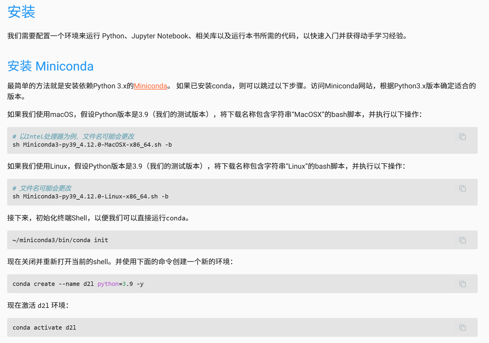

<center>Figure from <i>Dive Into Deep Learning</i></center>


## 流派之争 | Dispute of AI People


Q: 人工智能有哪些学派

A: 有名的有四个（它们当然不像整数分成正整数、0、负整数那样是不重不漏的，是有重叠、遗漏的）

1. 符号主义：即Minsky, Simon那派
2. 连接主义：即深度学习
3. 行为主义：即强化学习
4. 统计：即SVM

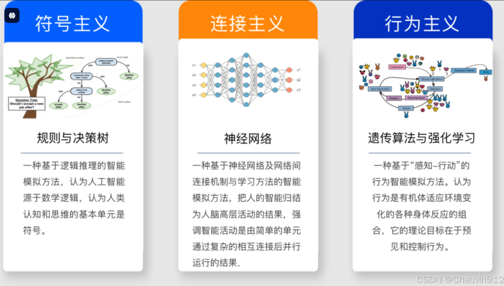

<center>Figure from <a href=''>Internet</a></i></center>

Q: 它们爆发过哪些激烈的斗争

A: 有两次最激烈

1. 符号主义 vs 连接主义：导致了深度学习第一次寒冬
2. 统计 vs 连接主义：导致了深度学习第二次寒冬


## Soft-Max

Q: Soft-Max 这名字是咋来的？有Hard-Max吗？

A: 它的定义是：$\frac{e^{z_i}}{\sum_i e^{z_i}}$。

名字来源嘛，你可以认为，传统的 Max 是Hard-Max，而它则是一种柔软的max。

比如，当输入是$[3, 2, 1, -1]$时。Hard-Max的结果是$[1, 0, 0, 0]$，Soft-Max的结果是$[0.657, 0.242, 0.089, 0.012]$。


## Sigmoid Like Curve

Q: S型曲线只有 $\frac{1}{1+e^{-x}}$ 吗？如果不是，为什么机器学习只用它？

A: S型曲线有多种，[维基百科有收录](https://en.wikipedia.org/wiki/Sigmoid_function)。


Q: 那为什么用它比较多呢？(PS: 其实tanh也有人用)

A: 一个原因是求导方便。


Q:  $\frac{1}{1+e^{-x}}$ 和 Soft-Max 的关系？

A: 前者用于二分类，后者用于多分类。（用前者时候，通常把大于0.5的标记为一类，小于0.5的标记成另一类。）


## 问答 | QA

Q: OpenAI等公司发布模型时时候会有测试集泄露的问题？

A: 肯定有。比如说 AIME (American Invitational Mathematics Examination) 和 IMO (International Mathematical Olympiad) 的数学题，肯定泄露到互联网数据里了。虽然他们有些[方法](https://wallstreetcn.com/articles/3737529?id=37853)，但是我认为不能完全避免。

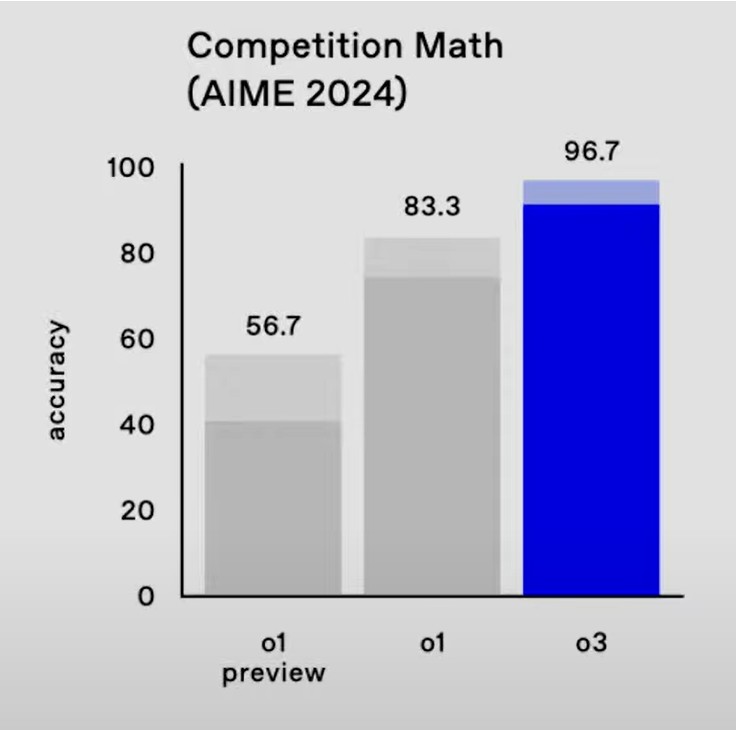

<center>Figure from <a href='https://www.youtube.com/watch?v=SKBG1sqdyIU&list=PLOXw6I10VTv9lin5AzsHAHCTrC7BdVdEM&index=12'>OpenAI</a></center>

Q: 那咋办？

A: 构建新的数据集。比如，OpenAI 发布 o3 时，使用了ARC和FrontierMath，两个新构造的数据集。

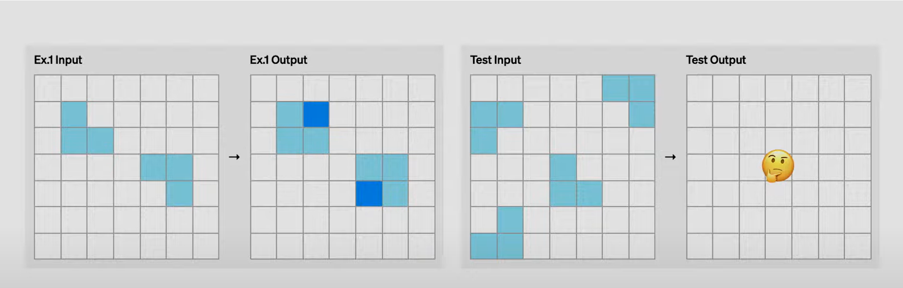

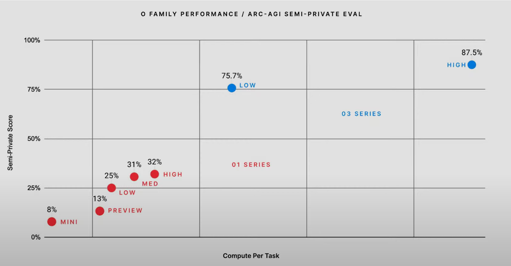

<center>ARC, Figure from <a href='https://www.youtube.com/watch?v=SKBG1sqdyIU&list=PLOXw6I10VTv9lin5AzsHAHCTrC7BdVdEM&index=12'>OpenAI</a></center>


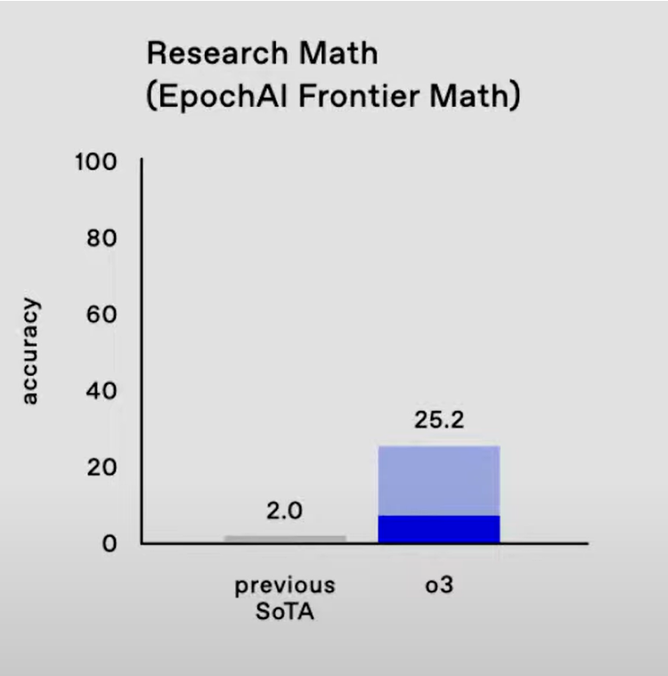

<center>Frontier Math, Figure from <a href='https://www.youtube.com/watch?v=SKBG1sqdyIU&list=PLOXw6I10VTv9lin5AzsHAHCTrC7BdVdEM&index=12'>OpenAI</a></center>


# Lecture 2 & 3: 有监督学习 | Supervised Learning

目标：分析有人类标签的数据 (Data With Human Label) 。


## 线性模型 | Linear Model

### 最小二乘 | Least Square

目标：回归（其实也可以分类，比如下图）。

灵感：勒让德和高斯观察天文学数据发明的，[俩人还吵起来了](https://zh.wikipedia.org/wiki/%E6%9C%80%E5%B0%8F%E4%BA%8C%E4%B9%98%E6%B3%95#%E6%AD%B7%E5%8F%B2%E8%83%8C%E6%99%AF)。

图像：


### 逻辑回归 | Logistic Regression

目标：分类。

灵感：当最小二乘用于分类时，找一个统计解释。

图像：


<center><a href="https://www.matongxue.com/">图片来自马同学</a></center>

### 支持向量机 | Supporting Vector Machine

目标：分类。

灵感：凸优化、统计。

名称来源：下图最后侧，最靠近分类边界的那几个点叫支持向量(Supporting Vector)，因此这算法叫支持向量机器(Supporting Vector Machine)。

优点：可以用Kernel把低维线性不可分的样本转变为高维中线性可分的样本。这是SVM超越最小二乘和逻辑回归之处。

图像：


<center><a href="https://www.matongxue.com/">图片来自马同学</a></center>

### 问答 | QA

Q: 正则到底是啥意思？

A: 正则一词来自古汉语

> 名余曰正则兮，字余曰灵均。战国 · 屈原《离骚》
>
> 辩方位而正则，五精帅而来摧。 汉 · 张衡 《东京赋》

它有美好、礼仪、法规的意思。

物理中的[正则变换(Canonical Transformation)](https://zh.wikipedia.org/wiki/%E6%AD%A3%E5%89%87%E8%AE%8A%E6%8F%9B)、机器学习中的[正则化(Regularization)](https://zh.wikipedia.org/wiki/%E6%AD%A3%E5%88%99%E5%8C%96_(%E6%95%B0%E5%AD%A6))、CS中的[正则表达式(Regular Expression)](https://zh.wikipedia.org/wiki/%E6%AD%A3%E5%88%99%E8%A1%A8%E8%BE%BE%E5%BC%8F)，都有“美好、法规、约束”的意思，因此都被翻译成了正则。


Q: LASSO (L1)和Ridge (L2)，这俩名字咋来的？

A: 

1. LASSO: Least Absolute Shrinkage and Selection Operator.
2. Ridge: 几何上，L2正则化的约束集对应一个高维球体。当你将这些球体等式约束（如半径不同的球）在参数空间中与最小二乘误差等高线（一般为椭圆）叠加时，它们的交点像是在“山脊”上寻找解（即在约束下的优化点常位于“椭圆谷”边缘）。


Q: 这张图到底啥意思？


<center>图片来自西瓜书</center>

A: 你要找两类等值线的交点。随后你就发现，L1的会在坐标轴上，L2的不在。


Q: 为什么不用L0, L3, L4,..., 作为惩罚项？

A: 

它们分是：

1. L0: $\#$ non zero elements
2. L1: $\sum_i |w_i|$
3. L2: $\sum_i w_i^2$
4. L3: $\sum_i w_i^3$
5. L4: $\sum_i w_i^4$
6. ...

至于为什么主要用L1和L2

1. L0计算上是NP-Hard。
2. L3、L4、更高阶的效果和L2差不多，但是可解释性不如L2。肯定有人用，但是不是主流。
3. L1有稀疏选择性。
4. L2有可解释性，可以和物理中的能量搭上关系。


Q: “回归”这词是咋来的？

A: [Francis Galton](https://en.wikipedia.org/wiki/Francis_Galton)，统计学创始人之一，研究了很多对父子的身高的关系。他发现最高的那批人的子女身高会没那么高(rank会下降)，最低的那批人的子女身高会没那么矮(rank会上升)，因此他把这种现象称之为Regression。中文翻译为回归，挺传神的。后来，人们把所有预测一个连续变量的方法都叫Regression，而Galton观察到的现象则被称之为[Regression Towards the Mean](https://en.wikipedia.org/wiki/Regression_toward_the_mean)。


## 决策树 | Decision Tree

### 引入 | Intro

目标：分类

灵感：模仿人类做决定

图像：


分裂标准/特征选择：基尼指数；香农熵增益；香农熵增益率。（见附录）


### 剪枝 | Prune

目标：对付过拟合


#### 预剪枝 | Pre-Pruning

图像：


<center>图片来自西瓜书</center>

重点：得有验证集。


#### 后剪枝 | Post-Pruning

图像：


<center>图片来自西瓜书</center>

重点：同上，得有验证集。


### 问答 | QA

Q: 决策树用的是贪心算法，因此得到的树未必是最优的？

A: 是。


Q: 决策树相比最小二乘和逻辑回归的最大优点？

A: 非线性。


Q: 听说决策树有很多种，主要区别是什么？


<center>图片来自西瓜书</center>


<center>图片来自老师的幻灯片</center>

A: 主要区别是分裂标准/特征选择。


Q: CART, ID3, C4.5的名字咋来的？

A:

1. CART: Classification And Regression Tree
2. ID3: Iterative Dichotomiser 3
3. C4.5: Classifier 4.5


Q: 没有其他特征选择方法吗？

A:


<center>图片来自西瓜书</center>

Q: 决策树做好之后，如果收了新的数据，只能从头训练吗？

A:


<center>图片来自西瓜书</center>

Q: 上述决策树都只能画横平竖直的线，不能画斜线吗？

A: 能。称之为多变量决策树。见西瓜书4.5。


<center>图片来自西瓜书</center>


<center>图片来自西瓜书</center>

## 集成学习 | Ensemble Learning

### 引入 | Intro

目标：结合不同学习器的优点

核心：**好而不同**

分类：


<center>图片来自西瓜书</center>

### 增强 | Boosting

目标：结合不同学习器的优点

核心：串行

图像：


<center><a href="https://www.matongxue.com/">图片来自马同学</a></center>

#### 自适应增强 | AdaBoost

核心：在Boost基础上加了权重

图像：


<center><a href="https://www.matongxue.com/">图片来自马同学</a></center>

#### 梯度增强树 | Gradient Boosted Decision Trees

核心：[对梯度进行一些操作](https://www.analyticsvidhya.com/blog/2021/09/gradient-boosting-algorithm-a-complete-guide-for-beginners/#h-what-is-a-gradient-boosting-algorithm)

变种

1. [XGBoost, 2014](https://en.wikipedia.org/wiki/XGBoost)
2. [LightGBM, 2016](https://en.wikipedia.org/wiki/LightGBM)
3. [CatBoost, 2017](https://en.wikipedia.org/wiki/CatBoost)

（这三个我也不懂，但应该不难，像工程。SVM的那些算法推导是真难，像数学/统计。）


### 袋子 | Bagging

目标：结合不同学习器的优点

核心：并行

名称来源：Bootstrap Aggregating

图像：


<center><a href="https://www.matongxue.com/">图片来自马同学</a></center>

#### 随机森林 | Random Forest

核心：Bagging只靠数据集不同来打造不同的模型，随机森林还可以加入决策树划分时随机性。

名称来源：如果 Bagging 算法都采用决策树的话，最终得到的集成模型就称为随机森林。“树”多了自然就组成了“森林”。

图像：


<center><a href='https://www.nvidia.cn/glossary/random-forest/'>图片来自NVIDIA</a></center>

注：据说，在随机森林中，使用最纯的决策树更好。下图是对鸢尾数据集的决策树分类，左侧为三层，右侧为最纯。


<center><a href="https://www.matongxue.com/">图片来自马同学</a></center>

注：选择属性时候没有随机性的随机森林可以叫决策森林。


<center>图片来自西瓜书</center>

### 改变投票方式 | Stacking

图像：


<center><a href="https://www.matongxue.com/">图片来自马同学</a></center>

### 问答 | QA

Q: 集成学习在现实中用得多吗？

A: 据我耳闻，是传统机器学习里用得最多的。最火的是XGBoost和随机森林。


Q: 决策树和集成学习比起深度学习如何？

A: 课上所讲的决策树和集成学习算法大多是深度学习第二次寒冬时（1990-2006）提出的。那时候它俩还有SVM完全压制了深度学习。


Q: XGBoost (2014) 和 LightGLM (2016) 是深度学习第三次崛起后提出的，它们比之后者如何？

A: 

优势

1. **前两者在小规模数据集上有可能超过深度学习。**
2. 前两者不需要众多GPU。
3. 前两者适合Kaggle竞赛和天池竞赛。

劣势

1. 前两者在大规模数据集上逊于深度学习。
1. 前两者需要人类专家设计特征。（因此可解释性也比深度学习好）。


Q: 为什么叫Boosting？

A: Boosting，是不断增强的意思。


Q: 为什么叫Bagging?

A: Bootstrap + Aggregating


Q: 集成学习可以用GPU加速吗？

A: [可以](https://developer.nvidia.com/blog/gradient-boosting-decision-trees-xgboost-cuda/)。只要是能并行的算法都可以（回忆一下高性能计算）。


# Lecture 4: 深度学习 | Deep Learning

目标：模仿人脑，用一大堆人工神经元实现通用人工智能。

数学保证：两层神经网络可以近似任何函数。

一些历史：


<center>图片来自西瓜书</center>

## MP 模型 | MP Model

目标：模仿人类神经元

时间：1943年

数学：$y = \sum_i w_i x_i$


## 单层感知机 | Perceptron

目标：通用人工智能**（从 Rosenblatt 提出感知机的那天起，这就一直是连接学派的目标和信仰）**

时间：1957年

本质：线性模型，和逻辑回归非常类似。

数学：$y = Sign(\sum_i w_i x_i + b)$

图像：


<center>图片来自西瓜书</center>

能力：**我估计它的能力和逻辑回归差不多。**之所以当年掀起深度学习第一次高潮，是因为它是生物学可行的，让大家看到了实现通用人工智能的希望。

一些历史：Frank Rosenblatt，Perceptron发明者，吹了一些不该吹的牛。他对媒体和公众表示，感知器未来可能能够“自动学习、自动解决问题，甚至可能会达到与人类大脑竞争的水平”（这说的不就是ChatGPT）。1969年，符号学派的Marvin Minsky和Seymour Papert合著的《感知器》一书中揭示单层感知机连异或都解决不了，而多层感知机的训练还束手无策。因此美国和苏联都停止了资助。这就是所谓的“第一次深度学习寒冬”。

（但是吧，如果不吹牛，深度学习怎么可能有后两次崛起？！）

（现在他们做成了，ChatGPT是由一层Tranformer、一层MLP组成的，Frank Rosenblatt也可以瞑目了。）

**（所以吹牛无所谓，最后把吹的牛都实现了就可以了。）**


## Hopfield 网络 | Hopfiled Network

目标：通用人工智能

时间：1982年

数学：感知机里，$x\in[0,+\infty]$；此处，$x \in \{-1, +1\}$

灵感：Ising Model

能力：在旅行商问题上取得了当时最好的结果。

图像：


## 全连接神经网络/多层感知机 | DNN/MLP

目标：通用人工智能

时间：1986年

成功原因：1986年提出的反向传播。

反向传播的本质：微积分中的莱布尼茨法则。推断 (Infer) 时是把输入一层一层前向传播，学习 (Learning) 时是把梯度下降的结果一层一层反向传播。

图像：


<center>图片来自西瓜书</center>

能力：1988年，Terry Sejnowski用它做出来人类历史上第一个能朗读自己从未见过的文本的机器(txt to speech)——[NETtalk](https://scholar.google.com/citations?view_op=view_citation&hl=en&user=m1qAiOUAAAAJ&cstart=20&pagesize=80&citation_for_view=m1qAiOUAAAAJ:Se3iqnhoufwC)。

能力瓶颈：[Terry Sejnowski 1988年就想过用 MLP 来预测蛋白质结构](https://scholar.google.com/citations?view_op=view_citation&hl=en&user=m1qAiOUAAAAJ&citation_for_view=m1qAiOUAAAAJ:zYLM7Y9cAGgC)，但是效果不佳，应该是数据、算力不足，所以模型没法做大。

参考：3Blue1Brown；西瓜书第五章。


## 卷积神经网络 | CNN

目标：处理图片。

时间：1995年由 Yann LeCun 发明，2012年由 Alex 发扬光大。

图像：（每个块块里是一大堆人工神经元）


<center>LeNet, 1995</center>


<center>AlexNet, 2012</center>

注：每层由好多复制。LeNet第一层有6个，AlexNet第一层有96个。他们的目标是提取不同特征。他们的卷积核不同是因为初始化的 $\vec{w_0}$ 不同。

数学：

1. 卷积：和微积分、概统里的卷积是一个意思。
2. 池化：就是取mean或者取max。

为什么适合处理图片？：因为图片中的特征在是有平移不变性的，所以CNN中权重可以共享。（即，同一特征（如边缘、角点、纹理等）可能出现在不同的位置。为了有效地检测这些特征，使用相同的卷积核在整个图像上滑动检测是合理且高效的。）

能力：AlexNet之后没几年，CNN就在图片识别上超过了人类。


## 循环神经网络 | RNN

目标：处理时间序列。

时间：2000年左右。（其实Hopfield也是RNN，但是现代的RNN主要是2000年左右提出来的，特别是1997年的LSTM）

图像：


<center>图片来自Dive Into Deep Learning</center>

能力：2006-2012，深度学习已有崛起前兆——当时RNN处理音频效果非常不错，为DL保留了一些火种和希望。


## 变形金刚 | Transformer

目标：处理自然语言。（2020年被拓展到了视觉上，所谓的ViT）

时间：2017年。

图像：


<center>图片来自Dive Into Deep Learning</center>

能力：只要数据和算力足够，目前啥问题都用Transformer。

能力：取代了LSTM。


## 生成式预训练变形金刚 | GPT

目标：通用人工智能。

时间：2018年。

图像：变形金刚、多层感知机、变形金刚、多层感知机、...


<center>图片来自3Blue1Brown</center>

为什么叫预训练？：此处的预训练指的是在通用数据集训练，之后再在特定任务上微调。与之相对的概念是从头训练，即直接在特定任务上训练。


## 能聊天的生成式预训练变形金刚 | ChatGPT

目标：通用人工智能。

时间：2022年。

图像：GPT + RLHF。


<center>图片来自3Blue1Brown</center>

能力：**在ChatGPT之前，没多少人相信深度学习能实现通用人工智能；在ChatGPT之后，没多少人不相信深度学习能实现通用人工智能。**


## 加了思维链的能聊天的生成式预训练变形金刚 | ChatGPT-o

目标：通用人工智能。

时间：2024年。

图像：（思维链这想法最迟22年1月就有了，但发扬光大的是OpenAI）


### ChatGPT-o1

能力：在AIME (American Invitational Mathematics Examination) 上拿到了80+的分数。

### ChatGPT-o3

能力：在AIME (American Invitational Mathematics Examination) 上拿到了90+的分数。

方法：可能只是把o1做大了，也可能有其它重要方法


## 滞留 | RetNet

目标：取代 Transformer

时间：2023年。

图像：


<center><a href = 'https://medium.com/ai-fusion-labs/retentive-networks-retnet-explained-the-much-awaited-transformers-killer-is-here-6c17e3e8add8'>图片来自Medium</a></center>


## 曼巴 | Mamba

目标：取代 Transformer

时间：2023年。

灵感：控制论

参考：见数学附录

图像：


<center> <a href="https://zhuanlan.zhihu.com/p/684231320">图片来自网络 </a></center>


## 问答 | QA

Q: 逻辑回归和单层感知机的相同点和不同点？

A: 两者都有 $w^T x + b$，但是激活函数、损失函数不一样。


Q: 为什么深度学习先驱们都在模仿生物神经网络？

A: 现在假设你就是Rosenblatt或者Hinton，你想要造一个很厉害的机器，比如说，原子弹。而你的邻居刚好有一个原子弹，那模仿它显然比从头造要快。


Q: 为什么从八十年代开始又逐渐不模仿了？

A: 后来你发现你邻居的原子弹是用自然选择制造的、费时费力（每次把进化好的留下来，差的丢弃），并且他总是藏着掖着不把核心技术告诉你（神经科学中的学习和记忆很难探究）。那你与其猜他的，还不如从头造。


Q: 为什么有人说BP是生物学不可行的(Biological Implausible)？

A: 因为，在生物神经网络中，误差不太可能一层一层准确地传回来。反着传一层有可能，一层一层传回来也太离谱了。


Q: 那梯度下降是生物学可行(Biological Plausible)的吗？

A: 争议很大。以前有人认为，凡是用全局信息的都不行，而梯度下降用了全局的能量函数；但现在有人提出，神经递质浓度也许可以代表全局信息。人类需要更多、更先进的实验手段才能回答这个问题


Q: 我听说深度学习成功有三个原因——数据、算力、算法，缺一不可，是吗？

A: 前两个肯定不能缺，第三个嘛，有的时候可以缺，有的时候不能

1. AlexNet ($6 \cdot 10^7$个参数) 和 LeNet ($6 \cdot 10^4$个参数) 相比，仅仅是做大了一千倍。这就是深度学习的苦涩教训——Bigger Is Better。所以不要像 LSTM 那样瞎想了，直接往大了做。
2. Transformer, RLHF, Chain of Thought, 都是人类智慧的结晶，也是 ChatGPT o1 成功的关键。


# Lecture 4 & 5: 无监督学习 | Unsupervised Learning

目标：分析无人类标签的数据 (Data Without Human Label) 。


## 聚类 | Clustering

**目标：揭示无标签的数据背后的规律。**

重要性：你别看他简单，其实非常实用！

方法：把无标签的数据划分为不同的集合。

参考: 西瓜书第九章；[Sklearn](https://scikit-learn.org/stable/modules/clustering.html)。

性能：见西瓜书9.2（要看一下，可能会考）

距离：见西瓜书9.3（此事较难，因为高维欧几里得空间有一些诡异的性质。所以要仔细思考怎么定义距离。）

图像：

1. 在前两行，DBSCAN（和它右侧的两个小弟）超过了 KMeans。
2. 在第五行，KMeans超过了DBSCAN（和它右侧的两个小弟）。
3. 第六行我也不知道是啥意思。
4. 前二行和第五行，ClusterDP可以收拾。这就是为什么我认为它强过KMeans和DBSCAN。


<center><a href="https://scikit-learn.org/stable/modules/clustering.html">图片来自sklearn</a></center>

### 基于原型 | Prototype Based

目标：聚类。

灵感：人们聚成小团体时候，每个团体总有一个领导者。我们把它称之为原型 (Prototype)。

PS: Prototype有领导者的意思，也有同一批中第一个被造出的机器的意思。有一个很有名的游戏，叫虐杀原型 (Prototype)，即为后者之意。


#### K 均值 | K-Means

图像：（看好，每个类都是球状的，即，[凸集合](https://zh.wikipedia.org/wiki/%E5%87%B8%E9%9B%86)）


<center>图片来自西瓜书</center>

缺点：

1. 需要预先指定聚类数量 K
2. 只适合球状数据（即，凸的）

#### 学习向量量化 | Learning Vector Quantization

图像：（每个类不一定是球状的）


<center>图片来自西瓜书</center>

#### 高斯混合 | Gauss Mixture

图像：（三个十字是三个高斯分布的中心）


<center>图片来自西瓜书</center>

### 基于密度 | Density Based

目标：聚类。

灵感：每个集合内部应该靠得比较近，并且距离其他集合都应该有一定距离。

例子

#### DBSCAN

图像：（每一步生成一个新类）


<center>图片来自西瓜书</center>

缺点：有两个超参数要调。（K-Means, ClusterDP只有一个）

#### OPTICS

Search the Internet.


### 基于层次 | Hieiarchy Based

目标：聚类。

灵感：集合之间**可能**是树状图的关系。

#### AGNES

图像：（哈哈，很简单吧）


<center>图片来自西瓜书</center>

#### DIANA

Search the Internet.


### 基于原型和密度 | Prototype and Density Based

目标：聚类。

灵感：既考虑原型，又考虑密度

#### 寻峰聚类 | ClusterDP

[原论文。](https://www.science.org/doi/abs/10.1126/science.1242072)

图像：（A图和C图，K-Means已经寄了；D图，上述的那几个除了估计都做不出来，DBSCAN精确调参有可能）


重要性：这个算法非常有名、有用、美观，要不然我也不会介绍给你们。

永远不要限制自己：这算法不是机器学习专家提出的，是两个已经转做计算物理/计算生物的人不务正业搞出来的。

后续：他俩2014年发明这算法之后，就继续搞自己的事去了。后来很多学者做了更进一步的工作，有的有用，有的只是水论文。他俩做了从0到1，从1到100交给别人，很酷。


## 降维 | Dimension Reduction

**目标：避免维度诅咒。**

重要性：我已说过，机器学习的目标是收拾复杂系统。既然是复杂系统，那么通常一个样本可能有成千上万个特征。这就是有名的“维度诅咒”。这会导致运算时间很长，也会导致模型可解释性变差。

方法：把无标签的数据从高维映射到低维。

参考：西瓜书第十章

### 线性 | Linear

#### 主成分分析 | Principle Component Analysis

方法：做一个线性变换罢了。

新坐标怎么找？：对 $X^T X$ 做一个特征值分解（Eigen Value Decomposition）罢了。或者说，对 $X$ 做一个奇异值分解，Singular Value Decomposition。$X$ 是数据集，一个方向是特征1、特征2、特征3……，另一个方向是样本1、样本2、样本3……

参考：[看看Josh Starmer的吧，这是他的成名之作](https://www.youtube.com/watch?v=FgakZw6K1QQ)。（PS：别人做过并且做得很好的东西，我就不想写了，我只想写别人没写过的东西）

可解释性：比[tSNE](https://en.wikipedia.org/wiki/T-distributed_stochastic_neighbor_embedding), [UMAP](https://umap-learn.readthedocs.io/en/latest/)好，也比用[VAE](https://en.wikipedia.org/wiki/Variational_autoencoder) (一种深度学习方法)做降维好（当然！），但不如原始特征（当然！）。

缺点：线性的，无法捕捉非线性关系。（神经科学里的论文经常上来就做PCA，这是有问题的）

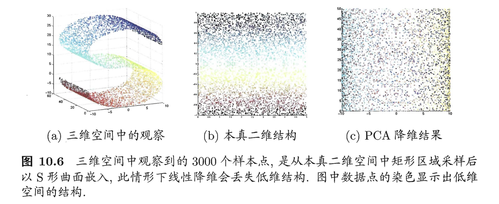

<center>图片来自西瓜书，一个S就让PCA瞬间破防</center>

#### 线性判别分析 | Linear Discrimination Analysis

参考：西瓜书 3.4。


### 非线性 | non-linear

例子

1. Kernelized PCA
2. tSNE
3. UMAP

参考：西瓜书 10.4、维基百科。


## 聚类和降维联用 | Joint Use of Clustering and Dim Reduction

方法：先降维，再聚类

注：通常嘛，拿到一大堆高维数据之后，首先要数据清洗，其次就是降维和特征选择，之后再搞别的事。别的事包括有监督学习、深度学习、聚类。（不过，如果是OpenAI和Google做大语言模型，他们应该不会搞降维和特征选择，但数据清洗依然很重要，[Garbage In, Garbage Out](https://en.wikipedia.org/wiki/Garbage_in,_garbage_out)）


## 问答 | QA

Q: K-Means要求制定集合的数目，那这不就是说它在实际中几乎没用吗？你在实际中咋可能提前知道有多少集合？

A: 可以用肘部法（Elbow Method）。除此之外，还有一些炫酷方法（我没用过）——Silhouette Score, Akaike 信息准则和贝叶斯信息准则。除了它们之外，还可以根据先验知识——至少知道簇的个数的大致范围。比如说，你可以根据电脑使用时间、一教出没时间、环资楼出没时间等对科大本科生聚类。你预先知道科大有10-20个院。

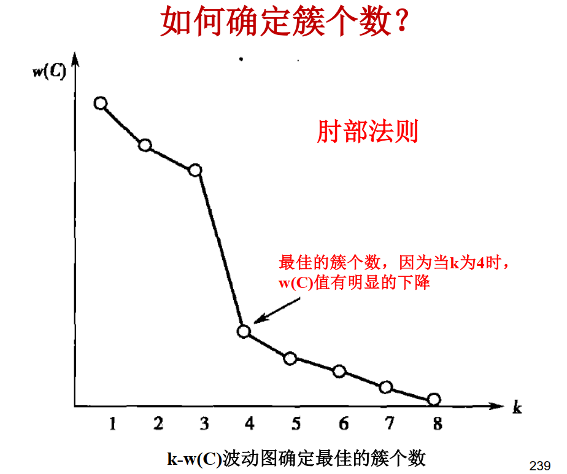

<center>图片来自老师的幻灯片</center>

Q: K-Means要求数据为球状（凸集）的，那这不也是在说它在实际中几乎没用吗？

A: 很多情况下的真实数据确实是球状的。


Q: 高斯混合模型中的概率是频率学派的还是贝叶斯学派的？

A: 贝叶斯学派的。和逻辑回归一样，如果能在某一个点继续收集数据，再用频率估计概率，得到的结果不一定是贝叶斯学派给的结果。至于为什么高斯混合模型能得到 $T = 2.26$，我也感到非常迷惑。


# 强化学习 | Reinforcement Learning

目标：模仿生物，用试错、奖赏、交互实现通用人工智能。

参考: 

1. *Reinforcement Learning, An Introduction*。(其实我不喜欢这书，勉强及格罢了——很多地方废话很多，很多地方故意把简单的东西搞复杂——比西瓜书、李航书、*Dive Into Deep Learning*、3Blue1Brown、Josh Starmer、马同学差远了，但我也找不到更好的RL书。**朋友们，知道更好的可以告诉我。**) 如果咱们看不懂一本书或者一节网课，通常是书和课的问题，而不是咱们的问题。
2. [*Reinforcement Learning | Mutual Information*](https://www.youtube.com/watch?v=NFo9v_yKQXA&list=PLzvYlJMoZ02Dxtwe-MmH4nOB5jYlMGBjr)：比上面那本书直观，但总感觉还差点意思。


## 非参数方法 | Nonparametric

目标：用非参数方法进行强化学习。

参考: *Reinforcement Learning, An Introduction, CH2-CH8*。

图像：无非就是下图的(2.4)罢了。

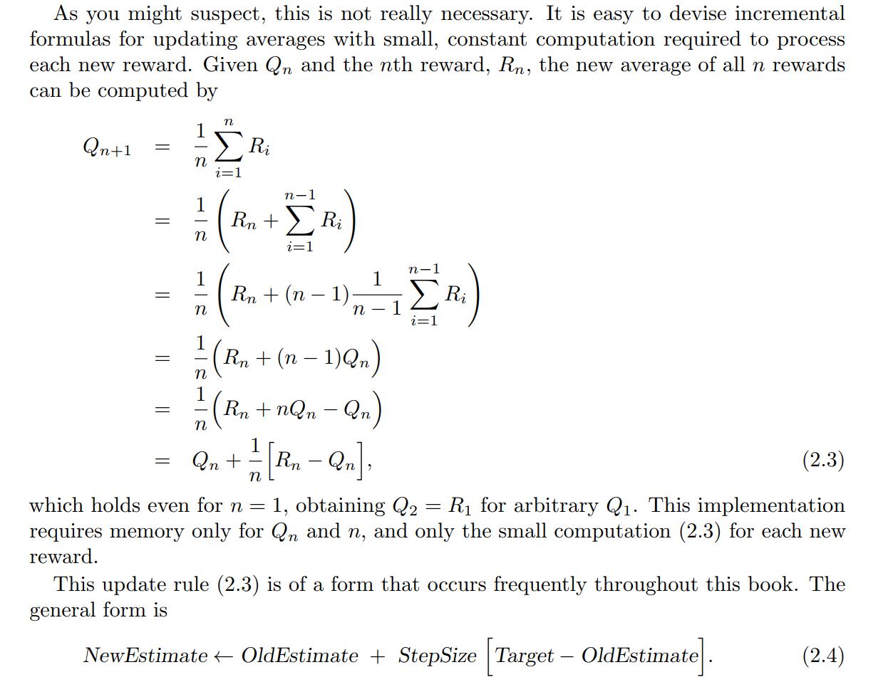

<center>Chapter 2 of <i>Reinforcement Learning, An Introduction </i></center>

## 参数方法 | Parametric

目标：用参数方法进行强化学习，从而把深度学习加进来。

参考: *Reinforcement Learning, An Introduction, CH9-CH13*。

图像：引入一个参数 $\vec{w}$。当然啦，通常它就是深度学习里的那个 $\vec{w}$。

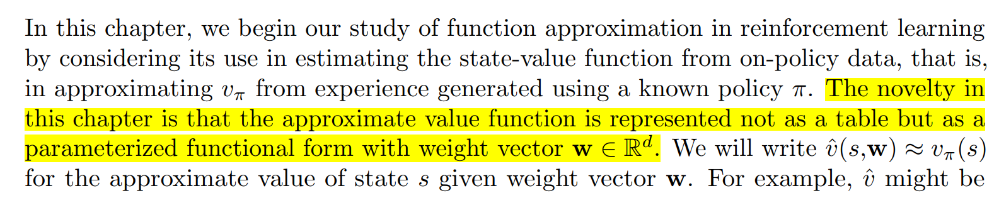

<center>Chapter 9 of <i>Reinforcement Learning, An Introduction </i></center>

# 其他 | Others

## 贝叶斯 | Bayes

目标：用贝叶斯学派的方式思考机器学习

方法：最简单的是朴素贝叶斯，即假设所有东西都独立

图像：


<center><a href="https://www.matongxue.com/">图片来自马同学</a></center>

趣事：曾经有人（休谟）问拉普拉斯——**如果不知道任何和太阳有关的物理规律，怎么计算太阳明天会升起的概率？**拉普拉斯采用贝叶斯的方式思考，并运用拉普拉斯平滑，给出了一个有趣的答案。你们可以猜一猜。


## 概率图 | Probability Graphical Model

目标：因果推断

图像：


<center>图片来自西瓜书</center>


<center>图片来自西瓜书</center>

## 懒惰学习 | Lazy Learning

目标：节省训练时间。

方法：懒惰地学习。等收到测试集再开始学习。

图像：以 K 近邻 (K Nearest Neighbot) 为例


<center>图片来自西瓜书</center>

## 特征选择 | Feature Seletion

目标：对付唯独诅咒

方法：选出有用的特征，丢弃无用的特征

例子：请了解下RELIEF，是非常漂亮的算法，见西瓜书CH11；我们以前学的正则化也可以视为特征选择。


## Pankaj Mehta 老兄的其他代码 | Other Codes of Pankaj Mehta

我都概括一下好了：

8：用Bagging集合多个感知机玩人造数据集。

10：用XGBoost玩超对称数据集（我也不知道超对称是什么意思）

14：用Pytorch造CNN玩Ising

16：用EM算法（贝叶斯算法之一）玩硬币。

17：用 Hopfield 和 Boltzmann Machine 重构、生成新的手写数字。

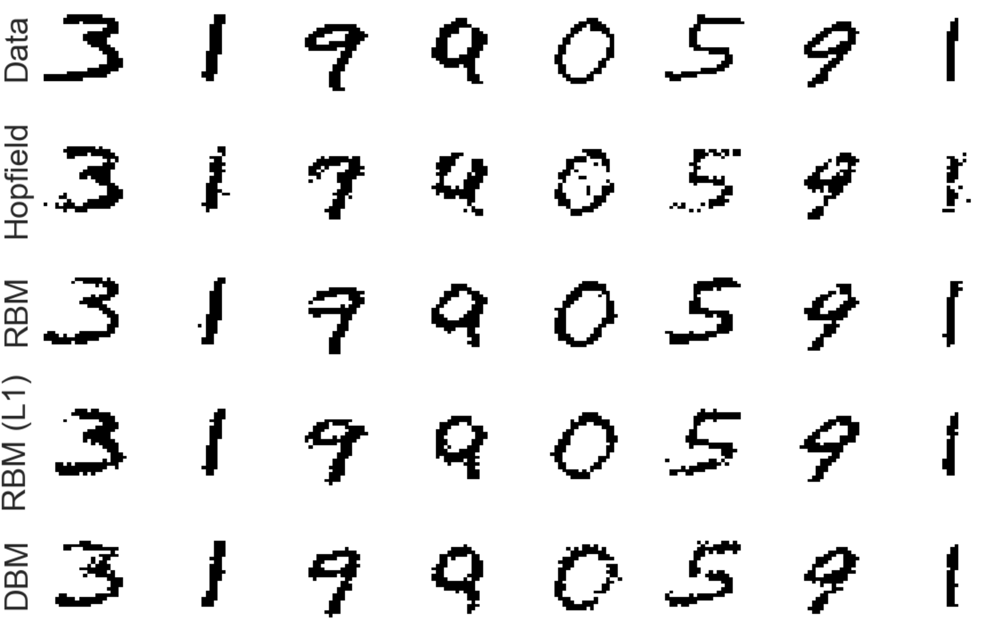

<center>图片来自Pankaj的<a href = 'https://physics.bu.edu/~pankajm/ML-Notebooks/HTML/NB17_CXVI_RBM_mnist.html'>NB17</a></center>

18：用 Hopfield 和 Boltzmann Machine 重构、生成新的Ising。

19：用VAE生成新的手写数字。

20：用VAE生成新的Ising。


# 库 | Libraries

1. [sklearn](https://scikit-learn.org/stable/): 开源组织负责，始于2007年。

2. [tensorflow](https://www.tensorflow.org/): Google开发，始于2015年。

3. [pytorch](https://pytorch.org/): Meta开发，始于2016年。


## 问答 | QA

Q: 我写的算法怎么才能被收录进sklearn？（来自某同学）

A: 只要你写得够好，就可以。贡献方法见[此处](https://scikit-learn.cn/stable/developers/contributing.html)。


# 大语言模型 | Large Language Models

## 竞技场 | Arena

https://lmarena.ai/

目标：让用户投票决定两个模型谁更厉害。

可以用什么：GPT, Gemini, Grok, LLAMA, Claude, qwen, Yi, GLM

我能做什么：多用。多传播（你们可以把它传播到班群或者院群）。我感觉这是世界上为数不多的又对自己有利又对全人类有利的事情。


## ChatGPT-3.5/4 水平 | ChatGPT-3.5/4 Level

美国

1. [ChatGPT | OpenAI](https://openai.com/index/hello-gpt-4o/) —— 最近和微软闹掰了，投奔苹果的怀抱。
2. [Gemini | Google](https://deepmind.google/technologies/gemini/) —— 最有钱。一心取代OpenAI。
3. [Claude | Antropic](https://www.anthropic.com/news/claude-3-5-sonnet) —— OpenAI 前员工，一对兄妹，创办的公司。一心取代OpenAI。
4. [LLAMA | Meta](https://llama.meta.com/) —— 和谷歌一样有钱。一心取代OpenAI。
5. [Grok | xAI](https://x.ai/blog/grok-2) ——和谷歌一样有钱。一心取代OpenAI。
6. [Nova | Amazon](https://aws.amazon.com/blogs/aws/introducing-amazon-nova-frontier-intelligence-and-industry-leading-price-performance/) —— 和谷歌一样有钱，但应该更侧重于和别人合作。
7. [Nemotron | NVIDIA](https://huggingface.co/nvidia/Nemotron-4-340B-Instruct) —— 和谷歌一样有钱，但应该更侧重于和别人合作。
8. [Command R | Cohere](https://cohere.com/blog/command-r) —— 初创公司。Tranformer最年轻作者成立的。
9. [Perplexity | Perplexity](https://www.perplexity.ai/) —— 初创公司。以搜索见长。

中国

1. [豆包 | 字节跳动](https://www.doubao.com/chat/)
2. [Kimi | 月之暗面](https://kimi.moonshot.cn/chat/ctftkrcjc3f1s6s6oh9g)
3. [GLM | 智谱](https://www.zhipuai.cn/) —— 和清华合作。**应该是此节唯一一个走Encoder-Decoder路线的。**
4. [Qwen | 阿里巴巴](https://help.aliyun.com/zh/model-studio/developer-reference/what-is-qwen-llm)
5. [星火 | 科大讯飞](https://xinghuo.xfyun.cn/)
6. [文心一言 | 百度](https://yiyan.baidu.com/) 
7. [Yi | 零一万物](https://x.com/01AI_Yi/status/1789894091620458667)
8. [Deep Seek | 深度求索](https://finance.sina.com.cn/money/bond/2024-08-06/doc-inchtaqz9972992.shtml)

法国

1. [Mistral | Mistral](https://chat.mistral.ai/chat/ce1f7927-6eb8-4d10-bfe6-29c870a66a27)

我的评价：以上，使用体验都差不多。

开源和闭源：以上要么是开源的，要么是免费使用的。


## ChatGPT-o1 水平 | ChatGPT-o1 Level

1. ChatGPT-o1 | OpenAI
2. Gemini-Thinking | Google


<center><a href="https://lmarena.ai/">图片来自竞技场</a></center>

3. Deep Seek V3-Thinking | Deep Seek （我问了一个问题感觉还不错。再过一周，竞技场排名就会出来，到时看看！）


# 广告 | ADs

## 深度学习的三起三落 | Ups and Downs of DL

1. 第一次兴起：1950，Perceptron
2. 第一次衰落：1969-1982
3. 第二次兴起：1982，Hopfield
4. 第二次衰落：1990-2006
5. 第三次兴起：2012，AlexNet
6. 第三次衰落：2020-2022
7. 第四次兴起：2022，ChatGPT

前两次衰落时，深度学习很少能申请到funding——于是，大多数人都离开了。

**只有极少数人(Geff Hinton, Yann LeCun, Jungen)坚持了下来，坚信这种方法一定能实现AGI。**

欲知更多，请来第三次习题课。


## 深度学习 vs 神经科学 | DL vs Neuro

1. Perceptron的灵感来自于[Louis Lapique](https://en.wikipedia.org/wiki/Louis_Lapicque), [Hodgkin & Huxley](https://en.wikipedia.org/wiki/Hodgkin%E2%80%93Huxley_model)对于单神经元的研究，以及[Hebb](https://en.wikipedia.org/wiki/Hebbian_theory)对于突触强度变化的猜测。
2. LeNet（第一个CNN）的灵感来自于[Hubel & Wiesel](https://en.wikipedia.org/wiki/Receptive_field)对于哺乳动物视觉的研究。AlexNet仅仅是把LeNet做大了。

欲知更多，请来第三次习题课。


## 强化学习 vs 神经科学 | RL vs Neuro

1. 2000年左右，[神经科学家发现多巴胺浓度和强化学习中的Reward Prediction Error非常一致](https://pmc.ncbi.nlm.nih.gov/articles/PMC6578666/)。这就是你小时候常常听说的——吃糖可以产生多巴胺。

欲知更多，请来第三次习题课。


# 数学附录 | Math Appendix

## 最小二乘的解析解 | Analytic Solution of Least Square

重复：线性回归和最小二乘是一个意思。

在最小二乘中，E的定义如下
$$
E(\vec{w}) := \sum_{i=1}^{n}(y_i-\vec{w} \cdot \vec{x_i})^2 = Y^TY + w^TX^TXw - 2w^TX^TY
$$


求一阶导，我们得到
$$
\frac{\partial E}{\partial \vec{w}} = 2(X^TXw-X^TY)
$$
于是
$$
\frac{\partial E}{\partial \vec{w}} = 0 \Rightarrow X^TX \hat w = X^TY
$$
那么有两种情况：

1. 当$X^TX$可逆时

$$
\hat w = (X^TX)^{-1}X^TY = X^\dagger Y
$$
where $X^\dagger := (X^TX)^{-1}X^T$ and  $X^\dagger$ is Moore-Penrose inverse.

2. 当$X^TX$不可逆时，$X^TX \hat w = X^TY$这个线性方程组有多个解，选择哪一个作为结果由算法的偏好决定。

什么时候$X^TX$可逆呢？

线性代数中有一个很有名的定理：$X列满秩 \Leftrightarrow X^{T}X 可逆$。而$X$的行数越多，线性无关的行向量**很可能**越多。线性无关的行向量越多，行秩、秩、列秩越大，X越容易列满秩。以下是几个例子：

* 在波士顿房价数据集中，X有506行和14列，X大概率列满秩。
* 在生物信息学中，通常feature数目比sample多，X大概率列不满秩。


## 逻辑回归的数值解 | Numerical Solution of Logistics Regression

逻辑回归（周志华书中称之为对数几率回归）中，我们假设
$$
\begin{Bmatrix}
P(y=+1|\vec{x},\vec{w},b) = \frac{1}{1+e^{- \vec{w} \cdot \vec{x} }} \\
P(y=0|\vec{x},\vec{w},b) = \frac{1}{1+e^{+ \vec{w} \cdot \vec{x} }}
\end{Bmatrix}
$$
注意，这是一个假设。

正是这个假设赋予了LR概率含义。$P(y=+1|\vec{x},\vec{w},b)$即样本$\vec{x}$是正例的概率，$P(y=0|\vec{x},\vec{w},b)$即样本$\vec{x}$是反例的概率。如下图所示，离分类直线越远，属于对应类的概率越大，在直线上的点属于任何一点的概率都为0.5。


<center><a href="https://www.matongxue.com/">图片来自马同学</a></center>

接下来推导E：

把伯努利分布的两个P写到一起
$$
P(y_i|\vec{x_i},\vec{w},b) = (P(y_i = +1|\vec{x_i},\vec{w},b))^{y_i} (P(y_i = 0|\vec{x_i},\vec{w},b))^{1 - y_i}
$$
似然函数为
$$
likelihood(Y|X,\vec{w},b) = \prod_{i=1}^{n} P(y_i|\vec{x_i},\vec{w},b)
$$
对数似然函数为
$$
ln(likelihood(Y|X,\vec{w},b)) & = & \sum_{i=1}^{n} ln(P(y_i|\vec{x_i},\vec{w},b)) \\
& = & \sum_{i=1}^{n} y_i \vec{w} \cdot \vec{x_i} - ln(1+e^{\vec{w} \cdot \vec{x_i}})
$$
最大化对数似然函数等价于最小化负对数似然函数，因此我们可以把$E$定义为
$$
E := \sum_{i=1}^{n} -  y_i \vec{w} \cdot \vec{x_i} + ln(1+e^{\vec{w} \cdot \vec{x_i}})
$$
It's hard to calculate $\frac{\partial E}{\partial \vec{w}}$ (According to Wikipedia, it doesn't have a close-form solution), so we use numerical method like gradient descent and Newton method to get the optimal solution $\hat w$.

P.S.: **此处的概率不是频率学派的概率，是贝叶斯学派的概率**。逻辑回归的目的是给线性模型找一个概率解释，恰好$\frac{1}{1+e^{-x}}$可以输出一个0到1之间的值，而且直觉上也符合（x越大越接近于1，越小越接近于0），就把它的输出当成概率好了。**如果能在某一个点继续收集数据，再用频率估计概率，得到的结果不一定是逻辑回归给的结果。**


## 香农熵 | Shannon Information

参考：[Entropy_(information_theory) on Wikipedia](https://en.wikipedia.org/wiki/Entropy_(information_theory))。

**定义**：
$$
H(f(x)) := - \sum_i f(x_i) log_2(f(x_i)) = E_{f(x)}(-log_2f(x))
$$
目标：定量地定义“信息"。

**灵感**：

1. [$S = k ln W$](https://www.bilibili.com/video/BV1PazyYMETc/?spm_id_from=333.1387.upload.video_card.click&vd_source=38ef32ce71fc9a790036b5de6f876e1a)
2. [猜数游戏](https://cloud.tencent.com/developer/news/918445)。

数学意义：$f(x)$的泛函。

物理意义：该离散型随机变量的不确定度。

下界：0

上界：$log_2(n)$


下界的推导：

当$f(x) = [0,0,...,0,1,0,...]$时，$H(f(x))$ 等于0。这时候，它的不确定性为0，含有的香农信息量也为0。这个事实的物理意义是——因为你已经知道$X$等于什么了，所以X的不确定性为0。


上界的推导：

根据琴生不等式 ([Jensen Inequlity](https://en.wikipedia.org/wiki/Jensen%27s_inequality))，
$$
\sum_i p_i log_2(\frac{1}{p_i}) \le log_2(\sum_i p_i \frac{1}{p_i}) = log_2(\sum_i 1) = log_2(n)
$$
显然，当$f(x)$为均匀分布时候，$H$ 刚好等于$log_2(n)$。这个事实的物理意义是——此时，因为你完全不知道$X$应该等什么，所以该分布的不确定性是最大的。

当$f(x)$既不是均匀分布也不是独热的时候，$0 < H(f(x)) < log_2(n)$。


Q: 信息一定要用香农的方式定义吗？

A: 不一定。[Fisher Information](https://en.wikipedia.org/wiki/Fisher_information)，费雪信息，是另一种。它的物理意义是某个参数对似然函数有多大影响，即前者给出了多少后者的信息。如果没有明确指出，本文中所有的信息指的都是香农信息。


Q: 交叉熵和香农信息的关系？

A: 下文的KL散度、交叉熵、互信息都是建立在香农对信息的定义之上的。说难听点，都是后者的儿子或者孙子罢了。


Q: 我听说，香农最开始发明信息论之后，测定了英文字母的熵，但是他具体如何编码呢？

A: 早年有两种方法

1. Shannon–Fano coding
2. Huffman coding


Q: 现在我们如何编码英文字母？

A: ASCII/UTF-8。浪费了空间，增强了可读性。但是，当你压缩文件的时候，会用类似Huffman coding的方法。[ZIP用的就是Huffman Coding](https://www.dremio.com/wiki/huffman-coding/#:~:text=Huffman%20Coding%20is%20used%20in,in%20reduced%20data%20size%20overall.)。


## KL散度 | KL Divergence

参考：[Kullback–Leibler divergence on Wikipedia](https://en.wikipedia.org/wiki/Kullback%E2%80%93Leibler_divergence)。

**定义**：

两个离散型随机变量的概率分布$f(x)$和$g(x)$之间的KL Divergence为：
$$
D_{KL}(f(x),g(x)) := \sum_i p(x_i) log \frac{p(x_i)}{q(x_i)}
$$
**目标**：衡量两个分布之间的差异。

> KL Divergence measures how one probability distribution diverges from a second, expected probability distribution. It quantifies the information lost when approximating one distribution with another. In a physical sense, it can be interpreted as a measure of inefficiency in using one distribution to represent another. It is often used in scenarios where one wants to understand how much information is "missed" when using a simpler model.

**灵感**：香农给出信息的定义之后，很容易就能想到KL散度。

数学意义：$f(x)$和$g(x)$的泛函。

物理意义：$f(x)$和$g(x)$之间的距离。

下届：0

上界：$\infty$


下界的推导：

根据琴生不等式 ([Jensen Inequlity](https://en.wikipedia.org/wiki/Jensen%27s_inequality))，
$$
\sum_i p_i log_2(\frac{q_i}{p_i}) \le log_2(\sum_i p_i \frac{q_i}{p_i}) = log_2(\sum_i q_i) = log_2(1) = 0
$$
则
$$
\sum_i p_i log_2(\frac{q_i}{p_i}) \ge 0
$$


上界的推导：

当$p(x_i)$不等于0而$q(x_i) \to 0$时，$D_{KL}$会趋向于无穷。因此它没有上界。


Q: 为什么不直接叫距离/度量？

A: 数学上的距离/度量 (Distance/Metric) 要满足对称性和三角不等式（[Metric Space on Wikipedia](https://en.wikipedia.org/wiki/Metric_space)），但是KL Divergence不满足。


Q: 那为啥叫散度？

A: 统计学家把满足距离四条定义里的前两条的叫散度。([Statistical Distance on Wikipedia](https://en.wikipedia.org/wiki/Statistical_distance))


Q: 和物理上的散度有啥关系啊？

A: 我感觉没啥关系。如果硬要扯上关系，它俩都有一种 separation 和 spread out 的感觉。


Q: 能否把它改造成满足对称性和三角不等式的东西？

A: 能。([Jensen–Shannon Divergence on Wikipedia](https://en.wikipedia.org/wiki/Jensen%E2%80%93Shannon_divergence))


## 交叉熵 | Cross Entropy

定义：

两个离散型随机变量的概率分布$f(x)$和$g(x)$之间的Cross Entropy为：
$$
CE(f(x),q(x)) := - \sum_i f(x_i) log_2 \ g(x_i) = E_{f(x)}(- log_2 g(x))
$$
目标：衡量两个分布之间的差异。（和$D_{KL}$相同）

灵感：香农给出信息的定义之后，很容易就能想到KL散度。

物理意义：Cross Entropy represents the “average code length” you end up with if you encode data following f but use a code *optimized for* g.

和上述两者的关系：显然，$CE(f,g) = D_{KL}(f,g) + H(f)$。

上式的物理意义：(Cost with the wrong code)=(Penalty) + (Ideal Cost)


Q: Cross-Entropy和似然的关系？

A：两者相等。


Q: Cross-Entropy 和Soft-Max, Sigmoid的关系？

A: 前者作为损失函数，后者作为给出概率的方法。


## Adam (Adaptive Moment Estimation)

定义：

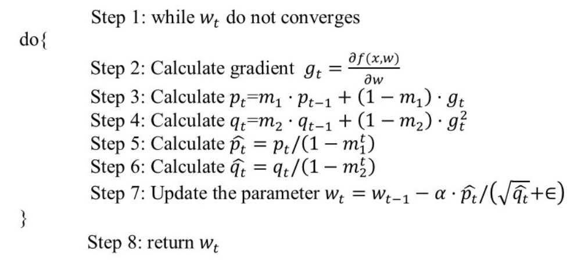

目标：加速收敛；更Robust。

灵感：几种早期自适应学习率算法（如 AdaGrad、RMSProp 等）、动量方法（Momentum）算法

注：此处的动量指的是保留之前若干次迭代的一些东西。


## 基尼指数 | **Gini–Simpson index**

定义：
$$
Gini := \sum_i \sum_{j \neq i} P_i P_j
$$
目标：定量地衡量一个集合的多样性。

灵感：它等于随机抽两个样本，不属于同一类的概率。

注：

1. 它仅仅是[多样性指标](https://en.wikipedia.org/wiki/Diversity_index)之一。
2. 它和经济学中用来衡量贫富差距的[Gini Coefficient](https://en.wikipedia.org/wiki/Gini_coefficient)不是一个意思。


## 自助法 | Boot-Strap

定义：


<center>图片来自西瓜书</center>

目标：数据增强（即，**当你数据不足时，如何凭空造出更多数据？**）。

灵感：来自统计学，她们估算统计量和做假设检验时经常用。

图像：


<center> <a href="https://en.wikipedia.org/wiki/Bootstrapping_(statistics)">图片来自维基百科 </a></center>

注：

1. 其名字来自于《吹牛大王历险记》。
2. 作为物理学家，你可以认为——**此法可以在不能再做实验时，凭空造出无数组实验**。


## 混淆矩阵 | Confusion Matrix

Q: Confusion Matrix 是什么？

A: 无非是个 2×2 的矩阵 $[a,b;c,d]$ 罢了。再根据 $a, b, c, d$ 这四个数做一些加减乘除。所谓的查准率、查全率、假阴性、假阳性、alpha、beta、hit、miss、第一类错误、第二类错误——都是 $a, b, c, d$ 的加减乘除。[维基百科有全收录](https://en.wikipedia.org/wiki/Confusion_matrix)。

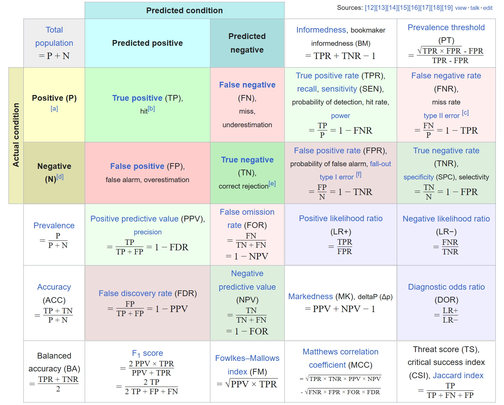

当然，这个矩阵可以从二分类拓展到多分类。


## 张量 | Tensor

Q: 深度学习里的Tensor和物理里的Tensor是啥关系？

A: 若用爱因斯坦上下标的记号，你可以认为前者只有下标，后者有上下标。


## 控制论 | Control Theory

起源：控制论最早起源于麦克斯韦对于回旋加速器的研究。

目标：施加外力，让机器保持在你想要的范围内。

例子：我只举一个例子


<center> <a href="https://bruce-yixuan-li.github.io/pdfs/A_Note_on_Control_Theory.pdf">图片来自我的控制论笔记 </a></center>

通过合适的控制，我们可以单摆稳定在它的不稳定平衡点


<center> <a href="https://bruce-yixuan-li.github.io/pdfs/A_Note_on_Control_Theory.pdf">图片来自我的控制论笔记 </a></center>

我们可以证明，只要你知道系统的方程，你可以把它控制在任何地方。

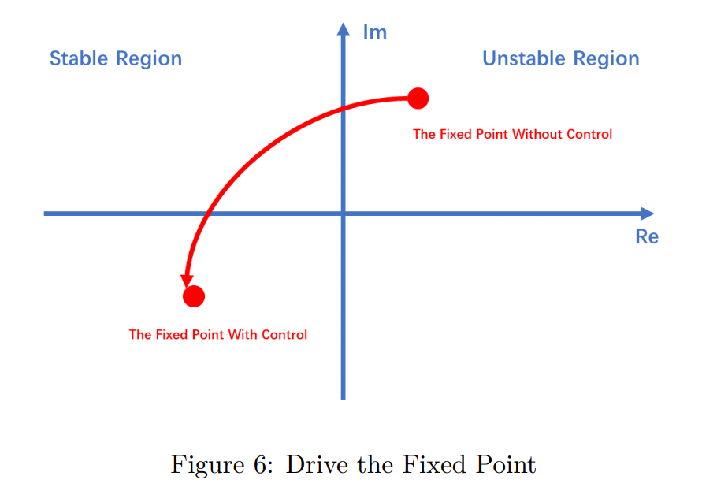

其实在MATLAB里用一行代码就能实现——` K = place(A,B,eigs_wanted)`。


<center> <a href="https://bruce-yixuan-li.github.io/pdfs/A_Note_on_Control_Theory.pdf">图片来自我的控制论笔记 </a></center>

作为一些特例，单摆能控制，双摆、三摆自然也能控制。

YouTube上的实验视频（强烈建议画几秒看看）: [Inverted Single Pendulum](https://www.youtube.com/watch?v=nOSTzpA0nGk), [Inverted Triple Pendulum](https://www.youtube.com/watch?v=I5GvwWKkBmg).

为什么要在这里讲控制论？因为 Mamba 用的就是控制论方程！（我笔记中的式子13）（[式子13的出处](https://en.wikipedia.org/wiki/State-space_representation)）


# 深度学习掀起的科学革命 | Science Revolution Caused by DL

> 如果终将失事，你是否还会扬帆远航？

----

有一位科学家叫 Jim Gray（1944-2007）。1998年因“对数据库和事务处理研究的开创性贡献以及系统实现中的技术领导地位”获得图灵奖（我至今也不理解他的工作，毕竟我非CS出身）。

他很喜欢一个人出去航海。2007年，他打算前往一个小岛，把母亲的骨灰撒在岛上。

但是，他再也没有回来。

他的朋友、学生中有不少都是计算机视觉的高手。他们在几千张影像中希望找到Gray的身影，但是一无所获。

---

Jim Gray 极富洞察。2006年左右（注意这个年份），他提出，在大数据时代，我们正在经历第四次科学革命。（那时候是深度学习第二次寒冬，他指的不是深度学习，仅仅是大数据。）他认为：

1. 第一范式：人类无脑地做实验，比如学会用火，比如建造埃及金字塔，比如发明造纸术。
2. 第二范式：始于伽利略。先提出一个理论，再做实验看实验和理论是否符合。如果不符合，修改理论。
3. 第三范式：始于电子计算机。计算机模拟现实中难做的实验。
4. 第四范式：始于大数据。Jim 认为，辅以大数据，计算机能理解复杂系统。

他去世后，他的思想、演讲、草稿被几位朋友整理成一本书，[the Fourth Paradigm](https://www.microsoft.com/en-us/research/wp-content/uploads/2009/10/Fourth_Paradigm.pdf)，并出版。他生前效力于微软公司，想必后者在书籍的整理和出版中也帮了不少忙。


<center> Slides from <a href = 'https://zhoupc.github.io/'>Pengcheng Zhou</a> </center>


<center> Figure 1 of <a href='https://www.microsoft.com/en-us/research/wp-content/uploads/2009/10/Fourth_Paradigm.pdf'> the Fourth Paradigm</a> </center>

---

2014年，一家AI公司，[第四范式](https://www.4paradigm.com/)，在中国成立。和大家猜的一样，[创始人说，名字是为了致敬Jim Gray](https://blog.csdn.net/leijianping_ce/article/details/137392978#:~:text=%E6%8D%AE%E6%88%B4%E6%96%87%E6%B8%8A%E4%BB%8B%E7%BB%8D%EF%BC%8C%E7%AC%AC%E5%9B%9B,%E8%80%8C%E4%B8%8D%E6%98%AF%E4%BA%BA%E6%9D%A5%E5%8F%91%E7%8E%B0%E3%80%82)。

---

我的想法和 Jim Gray 不太一样：

1. 伽利略之前的无脑实验：当然对人类进步很重要，当然是工程，但是似乎不能称之为自然科学。
2. 计算机模拟（这正是我们这门课，计算物理）：我认为和实验没有本质区别，只是把现实中难做的实验拿到计算机上了。依旧是“先提出一个理论，再做实验（或模拟）看实验（或模拟）和理论是否符合”。至于用计算指导实验，我认为，类似于预实验。

我觉得，人类历史上有三次科学革命：

1. 欧几里得等人撰写《几何原本》
2. 伽利略撰写《两种新科学》
3. Deep Learning （AlphaGo, AlphaFold, ChatGPT, AlphaGeometry）


第一点标志着数学的真正开端。**我们把一些规则当成公理，再用它们构建我们的体系，而不是只是算术和画图**。这就是数学。后来，统计的皮尔逊 (Karl Pearson)、费雪 (Ronald Fisher)，计算机的布尔 (Bull)、香农 (Claude Shannon)、司马贺 (Herbier Simon)，也都采用类似的思考方式。

第二点标志着自然科学的真正开端。**先提出一个理论，再做实验，看实验和理论是否符合，而不是单纯思辨或者无脑实验。**这就是自然科学。后来，化学的拉瓦锡 (Antoine Lavoisier)，生物的孟德尔 (Gregor Mendel)、巴斯德 (Louis Pasteur)、巴甫洛夫 (Ivan Pavlov)，医学的弗莱明 (Alexander Fleming)，心理学的冯特 (Wilhelm Wundt)，社会科学的众多政治家（各个经济政策都会先在几个城市搞试点），也用类似的思考方式。（天文和地质因实验较难，所以观察、模拟仍占主流。这只是无奈之举。如果能做实验他们肯定做实验。）

第三点，来自于很多人心底的疑惑——上帝的语言真的是数学吗？自然界的规律真的都可以用简单的数学语言或自然语言描述吗？也许答案是否定的。**到目前为止，人类能理解的规律要么能用几句数学语言描述、要么能用几张图描述、要么能用几句自然语言描述。**但复杂系统也许不能。而未来，**深度学习可以充当人类和自然界（特别是复杂系统）的“翻译软件”**。

---

在新的范式下，收拾复杂系统只需要三步：

1. 找到输入
2. 找到输出
3. 把输入和输出扔给人工神经网络

---

More Is Different，刚刚提出时是凝聚态物理的"独立宣言"，现在是笼罩整个人类社会的诅咒。

1. 人类能理解DNA -> RNA -> 蛋白质 (Crick Dogma)；但一个蛋白质发生改变后，会对个体的性状造成什么改变？
2. 人类能理解原子分子之间的相互作用 (Newton or Schrodinger)；但基于物理的方法在预测蛋白质结构上如此彻底地败给深度学习。
3. 人类能理解单神经元并准确地给出动作电位 (Hodgkin & Huxley)；但神经元一多，人类就束手无策。没有任何一个人知道生物神经网络如何实现学习和记忆，也没有任何一个人知道它为什么需要睡眠。
4. 人类发明了CNN, RNN, Transformer，知道其中的每一个单元、每一个相互作用、全部的学习方法；但人类无法理解它们为什么工作得如此之好，也无法预测它们对新事物的响应。

---

> 如果终将失事，我仍会扬帆远航。
>
> 因为航行本身就是一种追寻，是对未知的探索，是对梦想的执着。
>
> 因为扬帆远航的瞬间，生命才真正充盈。
>
> 因为那是一种无惧无悔的勇气。
>
> 因为那是在过程中寻找意义的慨然。
>
> 与其在岸边踟蹰不前，不如以热忱拥抱风雨，哪怕前路注定风高浪急，甚至必将失败，过程却充满了属于自己的光辉。
>
> 你呢，会选择出发吗？


# 深度学习掀起的技术革命 | Technology Revolution Caused by DL

和上一小节极富争议不同，深度学习将掀起新一轮技术革命、解放生产力，是不争的事实。我想它至少可以和以下几次技术革命并列：

1. 火
2. 第一次工业革命
3. 第二次工业革命
4. 电子计算机

在十年的时间尺度上，深度学习可能导致失业率飙升，也可能导致经济危机。但从百年的时间尺度上，这当然是好事。

这是最好的时代，这是最坏的时代。
